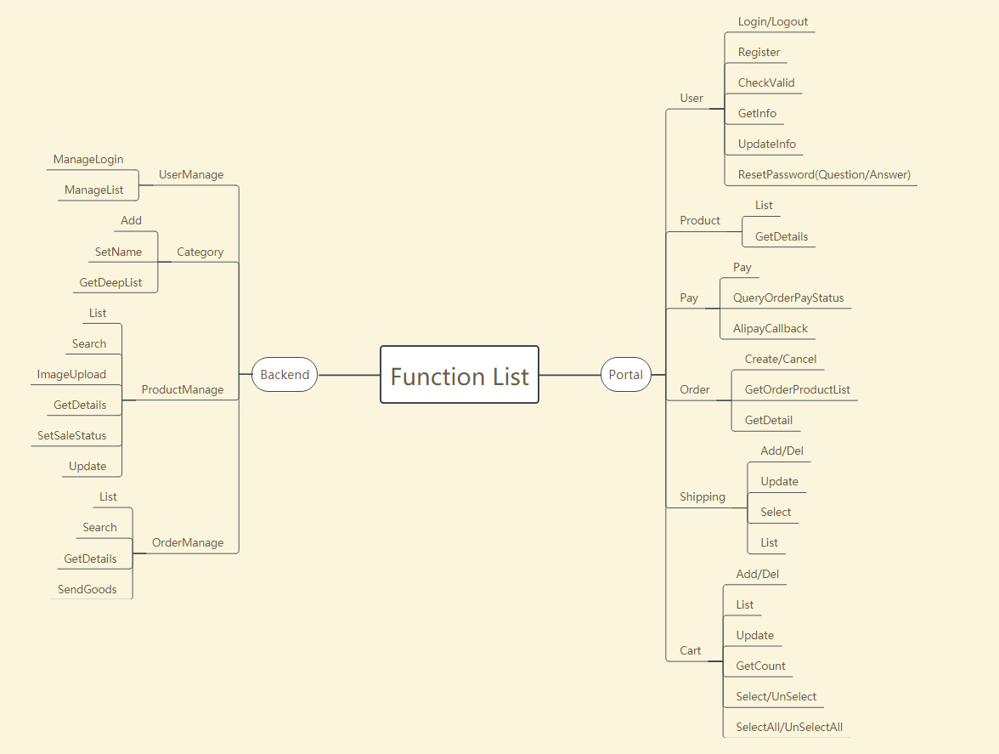
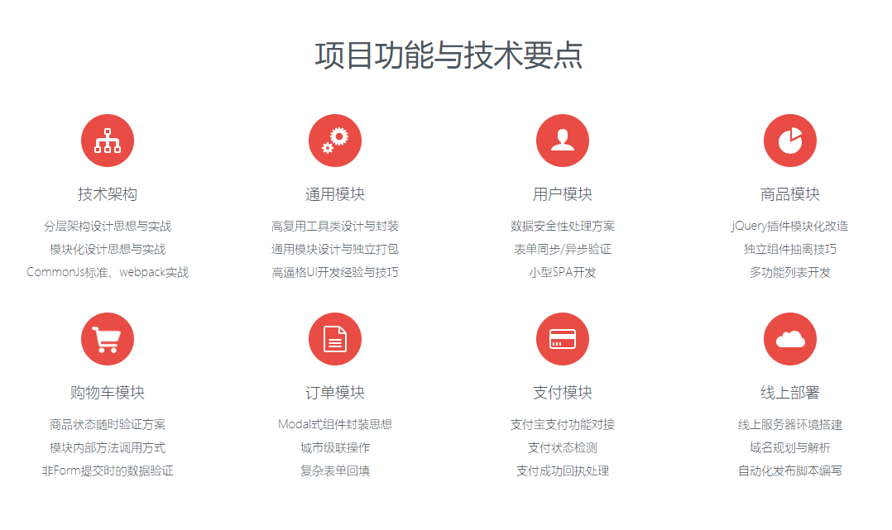
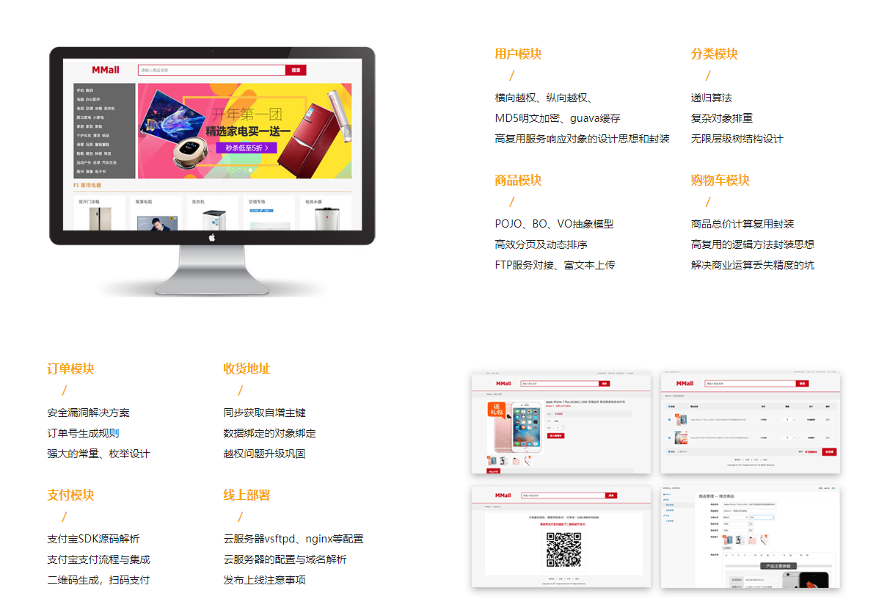
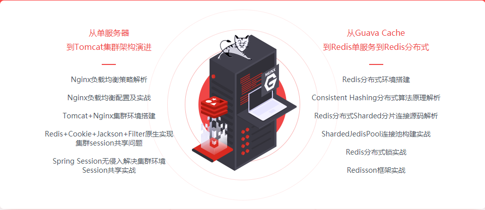
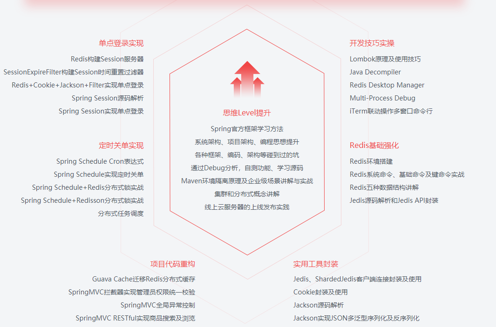

# igou / 爱购 ❤ 🛒

## 项目介绍

**`igou-mall` 项目是一个电商购物平台**

* 前台商城系统包含了首页门户、个人中心、商品展示、商品搜索、购物车、订单、支付等模块。

* 后台管理系统包含了用户管理、商品管理、订单管理。

## 技术栈

* ~~前端技术~~ **尚未开发**

Html + CSS + JQuery + React + Sass

* 后端技术

SSM + Guava + Jackson + Jodatime + MySQL + Tomcat + Redis + Redisson + Logback + Jedis + Maven + Nginx + Vsftpd + PageHelp + Lombok 
 
## 组织结构

* API
 

* 项目功能与技术要点

前端

后端

架构演进

## 参考资料

* [从0开始 独立完成企业级Java电商网站开发（服务端）](https://coding.imooc.com/class/96.html)
* [再谈前后端分离式 
手把手从0打造电商平台-前端开发](https://coding.imooc.com/class/109.html)
* [Java企业级电商项目架构演进之路
Tomcat集群与Redis分布式](https://coding.imooc.com/class/162.html)
